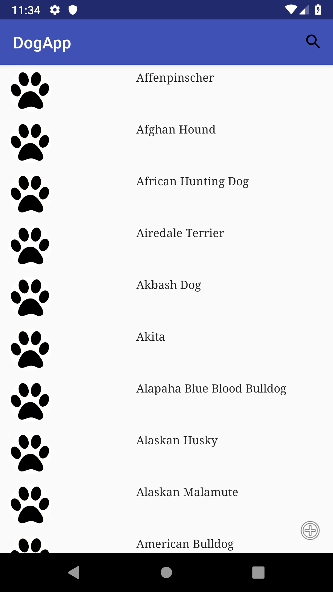
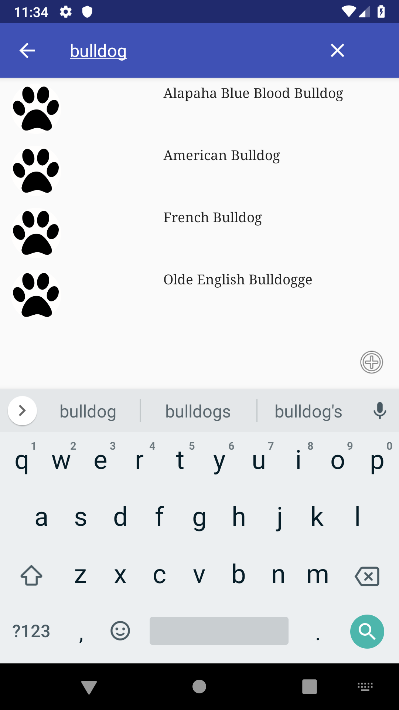
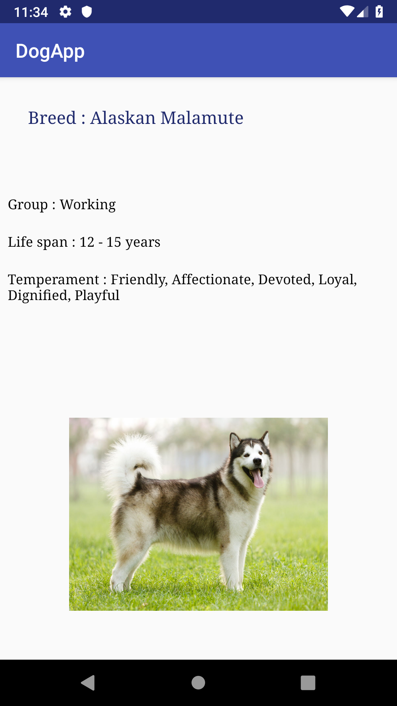

# Dog App

## Présentation

Projet utilisant un RecyclerView et récuperant des données à l’aide de l’API Rest (retrofit), codée en JAVA sous Android Studio.

Cette application affiche une liste de races de chien et permet, lorsque l'on clique sur une race, d'avoir des informations relatives à celle-ci, comme le groupe, la durée de vie et le tempéramment de l'animal.

### Prérequis

- Installer d'Android Studio
- Récuperer la branche master

## Consignes respectées :

- Deux écrans : Un écran avec une liste et un écran avec un détail de l’item.
- Appel à une API Rest.
- Stockage des données en cache.
- Architecture MVC
- Gitflow
- Option en plus : Barre de recherche

## Fonctionnalités

### Ecran Home

- Affichage de la liste de races de chien, avec possibilité de trouver une race en particulier grâce à une barre de recherche.

### Ecran Details

- Affichage des détails relatifs à une race en particulier : groupe, durée de vie, tempéramment et photo de l'animal.

